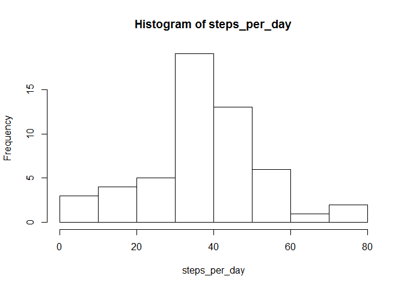
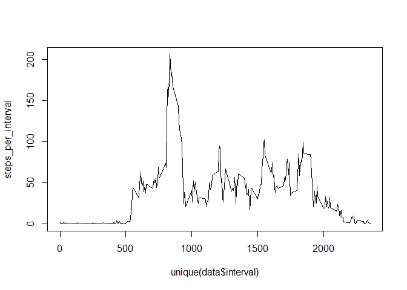
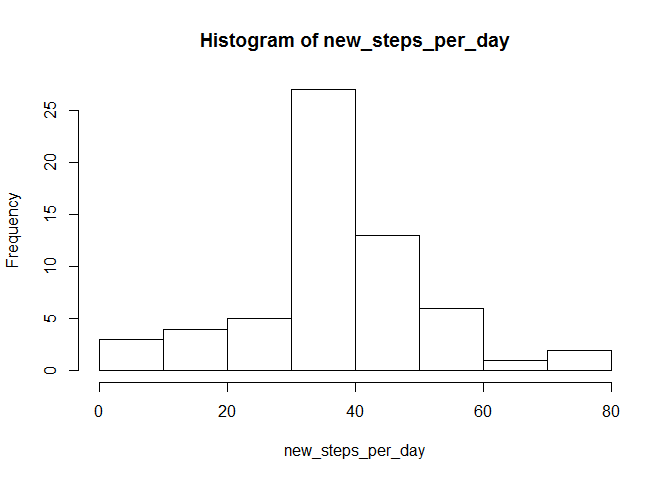
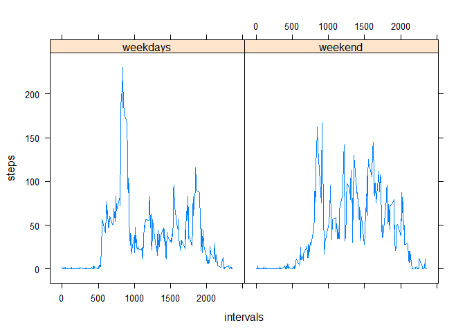

# Reproducible Research: Peer Assessment 1


## Loading and preprocessing the data

```r
setwd("C:/Users/iyarlin/OneDrive/Documents/coursera/Data Scientist spec/5. Reproducible research/project 1/RepData_PeerAssessment1")
data = read.csv("activity.csv")
```


## What is mean total number of steps taken per day?


```r
### calculate the overall number of steps taken by day
steps_per_day = tapply(data$steps,as.numeric(data$date),mean,na.rm = T)
hist(steps_per_day)
```

 

```r
mean = mean(steps_per_day, na.rm = T)
median = median(steps_per_day, na.rm = T)
```


## What is the average daily activity pattern?


```r
###calculate average number of steps taken per 5 minute interval
steps_per_interval = tapply(data$steps,data$interval,mean,na.rm=T)
plot(unique(data$interval),steps_per_interval, type="l")
```

 

```r
max_interval = unique(data$interval)[steps_per_interval==max(steps_per_interval)]
```

The 5-minute interval that on average across all the days in the dataset, contains the maximum number of steps is 835


## Imputing missing values

```r
total_na = sum(is.na(data$steps))
```

The total number of missing observations is 2304

Assuming that the difference in steps taken in each interval depends only 
on the number of interval in the day, but not the day itself, we'll fill the missing  
values by inputing the mean number of steps taken per each interval based on the 
non missing observations.


```r
### input missing observations
intervals = unique(data$interval)
missing_values = which(is.na(data$steps))
filled_na_data = data
for(i in missing_values){
  filled_na_data$steps[i] = steps_per_interval[data$interval[i]==intervals]
}
## produce steps histogram, calculate mean and median
new_steps_per_day = tapply(filled_na_data$steps,as.numeric(filled_na_data$date),mean,na.rm = T)
hist(new_steps_per_day)
```

 

```r
new_mean = mean(new_steps_per_day, na.rm = T)
new_median = median(new_steps_per_day, na.rm = T)
```

The new mean steps taken per day is 37.3825996  
The new median steps taken per day is 37.3825996


## Are there differences in activity patterns between weekdays and weekends?


I'll now procede to examine whether there is a difference in activity between weekdays and weekends


```r
## produce a binary variable receiving the value 1 for a weekend day and 0 for a weekday day.
filled_na_data$date = as.Date(filled_na_data$date)
Sys.setlocale("LC_TIME", "English") ## my computer runs Hebrew as default
```

```
## [1] "English_United States.1252"
```

```r
filled_na_data$week = factor((weekdays(filled_na_data$date)=="Saturday" | weekdays(filled_na_data$date)=="Sunday"),levels = c("FALSE","TRUE"),labels = c("weekday","weekend"))

## calculate 
steps_per_interval_weekdays = tapply(filled_na_data$steps[filled_na_data$week=="weekday"],data$interval[filled_na_data$week=="weekday"],mean,na.rm=T)
steps_per_interval_weekend = tapply(filled_na_data$steps[filled_na_data$week=="weekend"],data$interval[filled_na_data$week=="weekend"],mean,na.rm=T)
steps = c(steps_per_interval_weekdays,steps_per_interval_weekend)
week = factor(rep(c(1,2),each = 288), c(1,2),c("weekdays","weekend"))

steps_data = data.frame(intervals,steps,week)

library(lattice)
xyplot(steps ~ intervals | week,data = steps_data, type = "l")
```

 

It would seem there as some differeces in activity between weekdays and weekends
